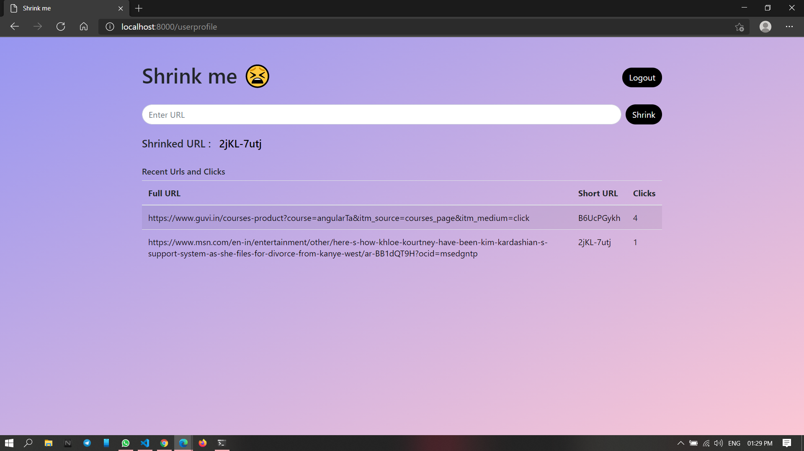

# Shrink Me

## url-shortener 

It is randomnly generated URL shrinker and shows no. of clicks (shrinked URL)

It also have login, logout functionality for security purposes.
For now the register option is hidden in UI but you can create new user by going into ```http://localhost:8000/register-signin```


<br>


you can simply run this in your local machine by typing below commands

*make sure you have node and mongodb(local) installed*
```git clone https://github.com/aruntemme/url-shortener```
```cd url-shortener```
you can configure db settings in ```server.js``` <br>
```mongoose.connect('mongodb://localhost:27017/YOURDB_NAME').then(console.log("DB connected"))```<br>
change db name as per your wish<br>

Install all dependencies
```npm i```<br>

Run 
```npm run devStart```

check your localhost
```http://localhost:8000/```

# Tasks

- [x] table to list previous urls
- [x] no. of clicks
- [x] login, sign up
- [ ] random + given text to generate url


# Keep Support

## Arun 😋
